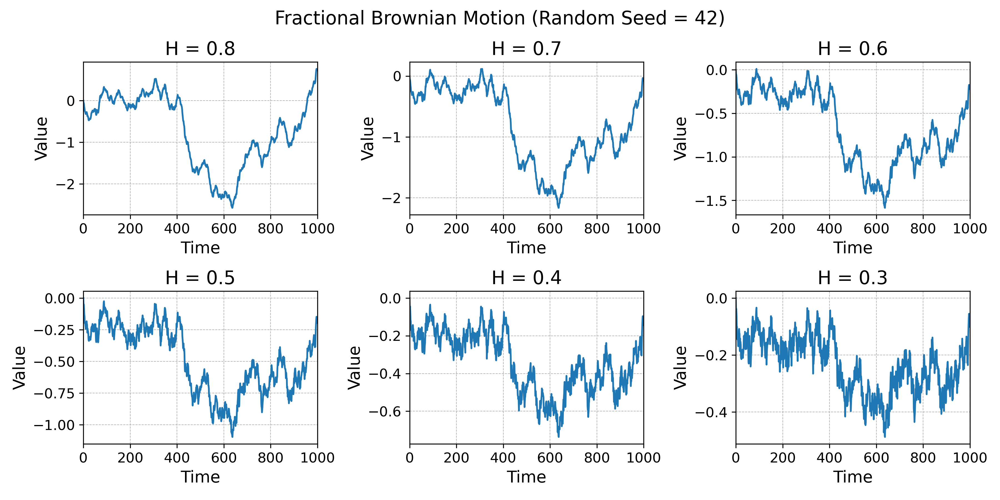
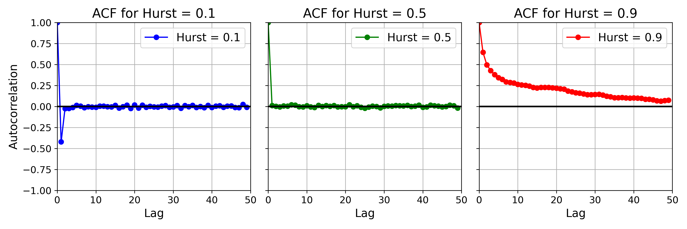
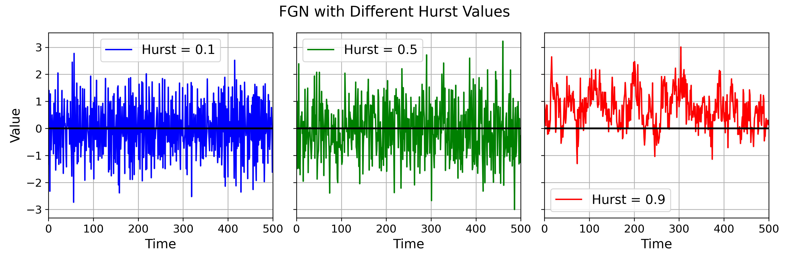
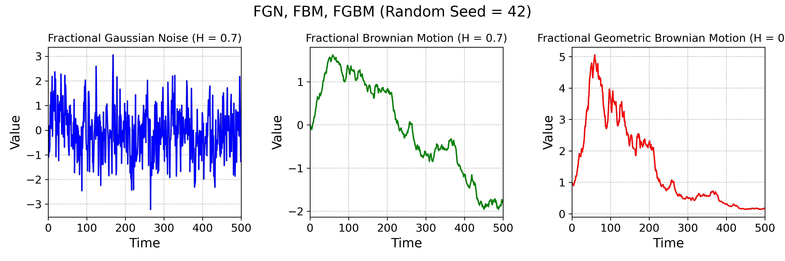
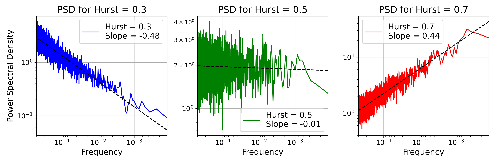

# Hurst Estimators

Hurst Estimators is a Python library for estimating the Hurst exponent and simulating fractional processes. This library includes popular estimators for the Hurst exponent and simulators for generating fGN, fBM, and fGBM processes.



Hurst estimation is often employed in:
- Finance
- Signal Processing
- Ambient Noise Analysis
- 1/f Noise Analysis (Colored Noise)
- Regime Detection
- Feature Engineering for downstream ML tasks 

## What is Hurst Exponent?

The Hurst exponent can be better understood by generating fGN with various Hurst values and inspecting their autocorrelations:
- H > 0.5: Long-range dependence or "Trending"
- H = 0.5: Lags are uncorrelated (Gaussian Noise)
- H < 0.5: Switching behavior or "Mean Reverting"

ACF plot with a Hurst of 0.1 clearly shows negative correlation for lag 1, indicating that large values will follow low values and vice versa. ACF plot with a Hurst of 0.5 has uncorrelated lags, resembling Gaussian noise as expected. On the other hand, a Hurst of 0.9 results in a long tail in the autocorrelation distribution.



These behaviors are also apparent in the time series plots.




## Installation

You can install the library using `pip`:

```sh
pip install hurst-estimators
```

or clone from the github repo:
```sh
git clone https://github.com/edesaras/hurst-estimators.git
```


## Quick Start


```python
import hurst_estimators as he
from hurst_estimators import periodogram_estimator, generate_fgn

# Generate Gaussian Noise
gn = generate_fgn(10000, 0.5)

# Use the periodogram_estimator (or the estimator of your choice)
hurst, slope, intercept, log_freqs, log_psd = periodogram_estimator(gn)
print(hurst)

>>> 0.49133168151805
```


## Available Methods
All estimation methods are based on log-log regression. Generally, log-scale values are regressed on a log-similarity measure. Differences between methods arise from the "similarity measure" used, e.g., PSD for the periodogram estimator and variation of wavelet coefficients for the wavelet estimator.

### Time Domain Estimators 
* Central Estimator
* Detrended Fluctuation Analysis (DFA) Estimator
* Generalized Hurst Exponent (GHE) Estimator
* Higuchi Estimator
* Rescaled Range (R/S) Estimator

### Frequency Domain Estimators
* Periodogram Estimator
* Welch Estimator

### Wavelet Estimators
* Average Wavelet Coefficient (AWC) Estimator
* Variance Versus Level (VVL) Wavelet Estimator

### Simulators
* Fractional Gaussian Noise (Circulant Embedding Method)

# Which Estimator to Choose?
# Is my data fGN, fBM, fGBM, or something else?
I don't know. That depends on the type of time series you have. This is for you to assume. But here is a plot of FGN, FBM, and FGBM:



If you think your data is normally distributed but not quite then use FGN. If *increments* of your data is normally distributed but not quite use FBM. If *log-differences* (or log-returns) of your data is normally distributed but not quite use FGBM.

# 1/f noise and Hurst

The relationship between the $\beta$ of 1/f noise and the Hurst parameter $ H $ is given by:

$$
H = \frac{\beta + 1}{2}
$$
where the spectral density $ S(f) \propto \frac{1}{f^\beta} $ is given by:
$$
S(f) \propto \frac{1}{f^\beta}
$$

The following log-log plot shows the relationship clearly:


## Contributing

## Citation

```bibtex
@software{edes_2024_11224470,
  author       = {Edes, Aras},
  title        = {{hurst-estimators: A Python library for Hurst 
                   exponent estimation}},
  month        = may,
  year         = 2024,
  publisher    = {Zenodo},
  version      = {v0.0.3-alpha},
  doi          = {10.5281/zenodo.11224470},
  url          = {https://doi.org/10.5281/zenodo.11224470}
}
```
